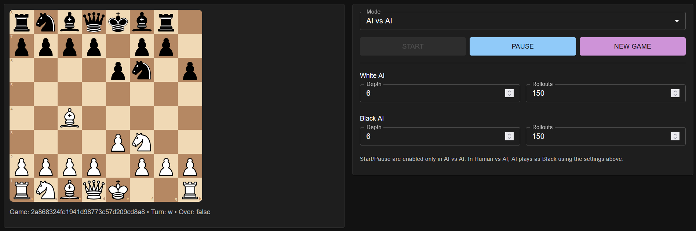
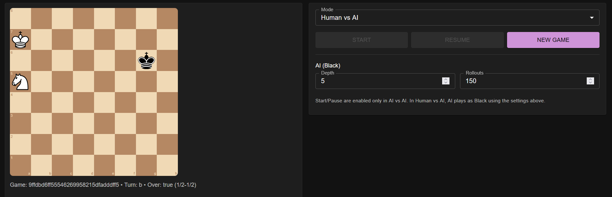

# repo_extract


This repository implements a **full-stack chess platform** with a modern architecture.  
It combines a web-based user interface, backend services for handling game logic, and a high-performance chess AI engine.

## 🎮 Demo


### Screenshot



### Components
- **Frontend (React)**: Provides the interactive web interface where players can start games, make moves, and visualize the chessboard in real time.  
- **Game State Service (Python + FastAPI)**: Manages chess rules, validates moves, keeps track of ongoing games, and serves data to the frontend via a REST API.  
- **Engine Wrapper Service (Python + FastAPI)**: Acts as a bridge between the backend and the AI engine. It translates game positions into engine-readable formats and returns the engine’s moves back to the game state service.  
- **Chess Engine (Rust)**: A custom-built chess engine using **alpha-beta pruning** and an **evaluation function**. Rust is chosen here for its **execution speed** and **memory safety**, allowing the engine to efficiently explore millions of possible positions per second.

### Why this architecture?
- **Separation of Concerns**: Each service has a clear role (UI, game logic, engine communication, AI computation).  
- **Performance**: Python services provide rapid development and clear APIs, while Rust powers the computationally heavy chess AI.  
- **Scalability**: With Docker and Docker Compose, all components can run independently and scale when needed.  
- **User Experience**: React ensures a smooth, dynamic, and responsive chess-playing interface.


## ✨ Features
- **Play Chess in the Browser**: A sleek React frontend provides the board, move history, and user interaction.  
- **Backend Game Logic**: Python FastAPI service ensures all moves follow chess rules and manages multiple concurrent games.  
- **AI Opponent**: A Rust chess engine uses alpha-beta pruning with an evaluation function to generate strong moves quickly.  
- **Engine Wrapper Service**: Bridges Python and Rust so the backend can communicate seamlessly with the high-speed AI engine.  
- **Dockerized Deployment**: Easily run all services together with Docker and Docker Compose.  
## 📂 Project Structure
```
.
  engine-svc/
  frontend/
  game-svc/
  README.md
  docker-compose.yml
  engine-svc/
    engines/
    .dockerignore
    Dockerfile
    app.py
    requirements.txt
    uci_bridge.py
    uci_main.py
    uci_parser.py
    engine-svc/engines/
      ab_engine_rust/
      ab_engine.py
      base.py
      engine-svc/engines/ab_engine_rust/
        src/
        Cargo.toml
        engine-svc/engines/ab_engine_rust/src/
          eval.rs
          lib.rs
          main.rs
          ordering.rs
          search.rs
          tt.rs
          types.rs
  frontend/
    src/
    Dockerfile
    index.html
    nginx.conf
    package.json
    tsconfig.json
    frontend/src/
      App.tsx
      api.ts
      main.tsx
      styles.css
  game-svc/
    Dockerfile
    app.py
    models.py
    orchestrator.py
    requirements.txt
```

## 🚀 Getting Started

### Prerequisites
- Python 3.10+

### Installation
```bash
python -m venv .venv
source .venv/bin/activate  # on Windows: .venv\Scripts\activate
pip install -U pip
pip install -r requirements.txt  # or `pip install .` if using pyproject/setup
```

### Run
See package scripts or main entry point.

### Tests
No tests configured yet.

## ⚙️ Configuration
- Copy `.env.example` to `.env` if present, and fill required variables.
- Review config files in the repo (e.g., Dockerfile, compose, Makefile) if available.

## 🧱 Tech Stack
- Primary: Python

## 📦 Dependencies
- See project files for details.

## 🐳 Docker
- Dockerfile detected. Build with `docker build -t {project_title.lower()} .`
- Compose file detected. Up with `docker compose up`

## 🤝 Contributing
Pull requests are welcome. For major changes, please open an issue first to discuss what you would like to change.

## 📄 License
Add a license to clarify usage.

---

> Generated README template tailored from repository contents.
