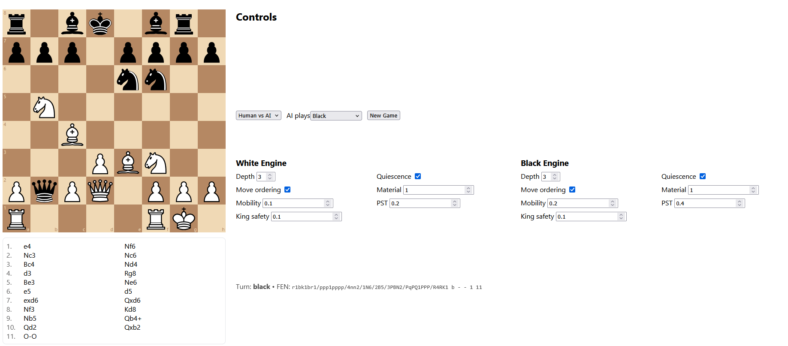

# Chess AI Project

A modular, containerized chess engine with a React-based UI, built to support human-vs-AI, AI-vs-AI (self-play), and configurable AI parameters for both sides.

---

## **Purpose**

The goal of this repository is to provide:
- A **clean, modern web interface** for playing and visualizing chess games.
- An **AI chess engine** that can be tuned with different parameters.
- A **game coordination service** that orchestrates moves between human players and one or more AIs.
- A **microservice architecture** that allows flexibility in replacing or improving components independently.

---

## **Architecture Overview**

This project is split into **three main services**:

1. **`engine-svc`** – *Chess Engine Service*
   - Implements the AI logic to compute best moves.
   - Exposes endpoints for:
     - `/bestmove` – given a position and parameters, return the best move.
     - `/health` – health check.
   - Written in **Python + FastAPI** using **Pydantic** for data validation.

2. **`game-svc`** – *Game Coordinator Service*
   - Maintains game state, validates moves, and talks to the engine(s).
   - Orchestrates AI-vs-AI self-play.
   - Exposes endpoints for:
     - `/new` – start a new game.
     - `/move` – make a move.
     - `/ai_move` – let AI play one move.
     - `/selfplay_step` – step through a self-play game.
     - `/tune` – update engine parameters mid-game.
   - Written in **Python + FastAPI**.

3. **`gui`** – *Frontend (React)*
   - Displays a chessboard and move list.
   - Lets you configure AI parameters per side.
   - Supports self-play mode with auto-running games.
   - Built with **React**, **TypeScript**, **react-chessboard**, and **Vite**.
   - Served via **Nginx** in Docker.

---

## **Tech Stack**

### Backend
- **Python 3.11**
- **FastAPI** – API framework for `engine-svc` and `game-svc`.
- **Pydantic** – request/response schema validation.
- **httpx** – internal HTTP requests between services.
- **chess.py** – chess move validation & board state.

### Frontend
- **React 18 + TypeScript**
- **react-chessboard** – interactive chessboard.
- **chess.js** – client-side chess logic.
- **Vite** – fast build tool.
- **Nginx** – static file server in production.

### DevOps
- **Docker Compose** – orchestrates all three services.
- **Alpine-based images** – lightweight container images.

---

## **Modular Approach**

- **Independent services** – Each microservice can be replaced without affecting the others.
- **Loose coupling** – Communication is via HTTP APIs.
- **Parameter tuning** – Both engines can run with different search depths, evaluation weights, and heuristics.
- **No persistence (yet)** – State is kept in-memory per service instance.

---

## **Installation & Running**

### **Prerequisites**
- **Docker** and **Docker Compose** installed.
- Hardware: Works on Windows, macOS, and Linux.

### **Steps**
1. Clone the repository:
   ```bash
   git clone https://github.com/yourusername/chess-ai-project.git
   cd chess-ai-project
   
2. Build and start all services:
    ```bash
    docker compose up --build

3. Open the UI in your browser:
    ```bash
    http://localhost:8080
   
---
## Configuration

### Environment Variables
- ENGINE_URL – URL of the engine service (default: http://engine-svc:8001)
- GAME_URL   – URL of the game service (default: http://game-svc:8000)

These are already set up for internal Docker networking via Docker Compose.

### Ports (change in docker-compose.yml if needed)
- GUI        : 8080 -> 80
- game-svc   : 8000 -> 8000
- engine-svc : 8001 -> 8001

### Healthchecks
- engine-svc implements GET /health; compose waits for it before starting game-svc.

---
## User Interface



---
## API Overview

### Engine Service (engine-svc)
- GET  /health         -> { ok: true }
- POST /bestmove       -> body: { fen: string, params?: EngineParams }  returns: { move: string | null, score: number }
- POST /evaluate       -> body: { fen: string, params?: EngineParams }  returns: { score: number }

### Game Service (game-svc)
- POST /new            -> create a game
                         body: { fen?: string, ai_mode: "human-vs-ai" | "self-play", ai_plays: "white" | "black" | "both", params_white?: EngineParams, params_black?: EngineParams }
                         returns: { gameId, fen, turn, movesSAN, result, lastMove, aiMode, aiPlays, paramsWhite, paramsBlack }
- GET  /state?gameId=  -> current state
- POST /move           -> body: { gameId: string, move: string (UCI) }  applies a human move
- POST /ai_move        -> body: { gameId: string }                       engine plays one move if it’s AI’s turn
- POST /selfplay_step  -> body: { gameId: string, steps?: number }       advances N half-moves (AI vs AI)
- POST /tune?gameId=&side=white|black
                       -> body: EngineParams                             updates engine params mid-game

(Interactive docs available at /docs for both services when running in containers.)

---
## Development Tips

Rebuild a single service (example: engine):
  docker compose build engine-svc --no-cache
  docker compose up

Tail logs:
  docker compose logs -f engine-svc
  docker compose logs -f game-svc
  docker compose logs -f gui

Curl example (engine bestmove):
  curl -X POST http://localhost:8001/bestmove -H "Content-Type: application/json" -d '{"fen":"rnbqkbnr/pppppppp/8/8/8/8/PPPPPPPP/RNBQKBNR w KQkq - 0 1","params":{"depth":3}}'

- Frontend local dev (optional):
  * cd gui
  * tab npm install
  * npm run dev
  * open http://localhost:5173

---
## Troubleshooting

- npm notarget / peer dependency errors during GUI build
  * Use React 18 + react-chessboard@4.7.2
  * Delete gui/package-lock.json
  * Rebuild GUI with --no-cache

- pip: "no such option: ---"
  * requirements.txt contains stray Markdown (--- or ```). Replace with the exact lines.

- ImportError: attempted relative import
  * Use absolute local imports (e.g., from params import PSTS)
  * Ensure ENV PYTHONPATH=/app is set in engine Dockerfile

- /ai_move returns 422
  * Backend must accept {gameId} only via AiMoveRequest
  * GUI should call aiMove(gameId) without a move

- httpx.ReadTimeout from game-svc -> engine-svc
  * Lower depth or increase engine budget (max_time_ms, max_nodes)
  * Optionally raise httpx client timeout in game-svc

- Self-Play 400 (not in self-play mode)
  * Click Run; GUI auto-creates a new self-play game with ai_plays: both

- Nginx “start worker process …” spam
  * Harmless. If noisy, set worker_processes 1; in gui/nginx.conf

Windows tip (remove lockfile):
  PowerShell: if (Test-Path .\gui\package-lock.json) { Remove-Item -Force .\gui\package-lock.json }
  CMD      : del gui\package-lock.json
  Git Bash : rm -f gui/package-lock.json

---
## FAQ

Q: Is this strong?
A: It’s educational: decent at low depths, not a Stockfish rival. Focus is clarity and hackability.

Q: Can I swap in a stronger engine?
A: Yes. Replace engine-svc or add a second engine service. game-svc talks HTTP.

Q: Does it save games?
A: No DB now. State is in-memory in game-svc. You can export FEN from /state and add persistence later.

Q: macOS/Linux support?
A: Yes. Docs mention Windows, but Docker makes it portable.

Q: Can White/Black use different parameters?
A: Yes. GUI exposes separate parameter forms per side.

---
## License

MIT (or change to what you prefer). See LICENSE.

---